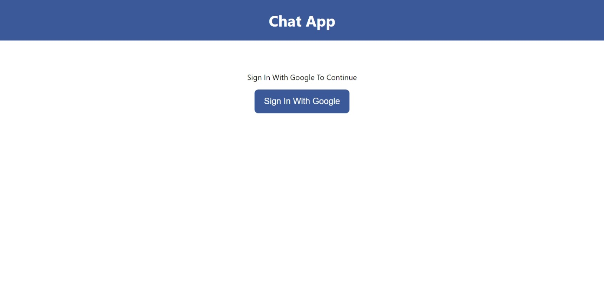
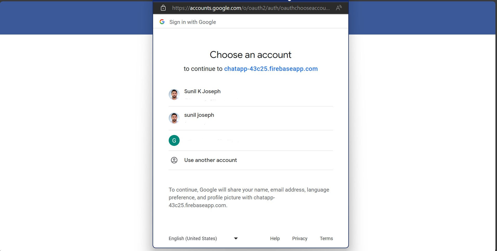
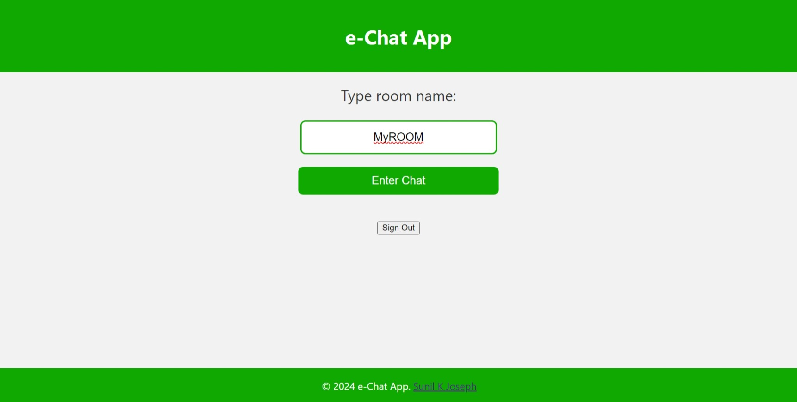

# React Chat App

Welcome to the React Chat App! This application provides a simple chat interface where users can join different chat rooms and communicate in real-time.

## Features

- **Authentication:** Users can sign in using their Google account.
- **Multiple Chat Rooms:** Users can join different chat rooms to communicate with others.
- **Real-time Messaging:** Messages are updated in real-time using Firebase Firestore.

## Technologies Used

- React: JavaScript library for building user interfaces.
- Firebase: Backend services for authentication and real-time database.
- Universal Cookies: Library for handling cookies in a cross-environment (browser and server) way.

## Prerequisites

- Node.js and npm installed on your machine.

## Usage
- Sign in with your Google account.
- Choose a chat room or create a new one.
- Start chatting with others in real-time.

## Author

    Sunil K Joseph, Asst. Professor, Dept. of Computer Science, Mar Augusthinose College, Ramapuram.

## Screenshots

